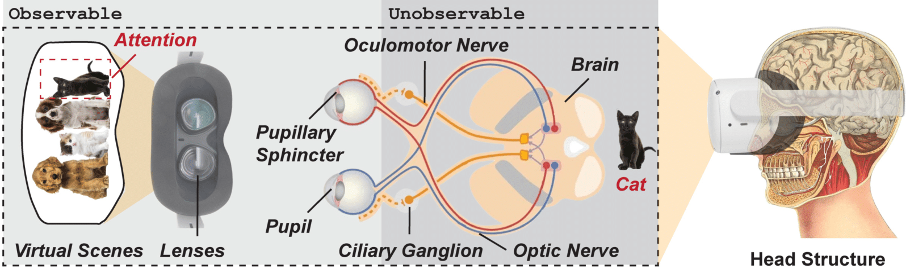

# Artifact of MetaBrain (In Submission of USENIX Security'25)

     

## Content

* Folder `Code`: Python/MATLAB code for preprocessing data, extracting features, and developing the models in MetaBrain.

* Folder `BCI_Device`: The explanations of how to using our non-invasive BCI device to capture EEG signals.

* Folder `Data_BCI` and `Data_Motion`: Data collected from BCI devices and VR motion sensors.

* Folder `Models`: Pre-trained models.

* **More details will be available for artifact evaluation.**

## Ethical Considerations

<ins>This anonymous repository is used for artifact submission only.</ins> This work takes ethical considerations seriously, and it has been approved by our IRB to collect data from human participants. MetaBrain and our custom-built attacking prototype have NEVER been released to any other parties.